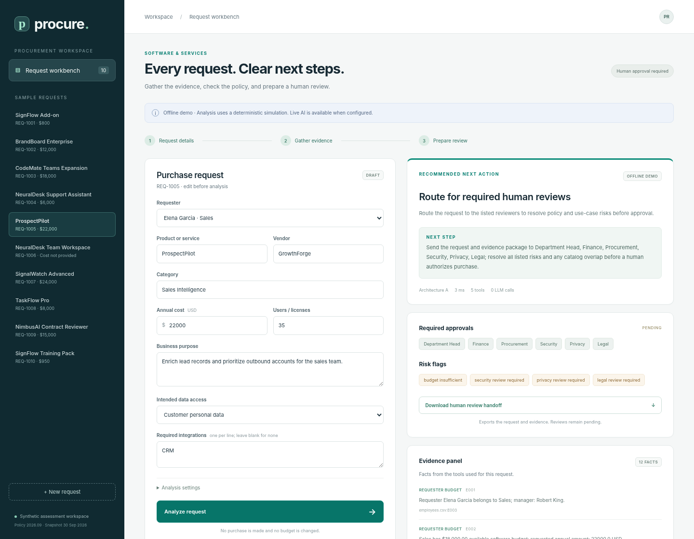

# Procure — AI Procurement Request Copilot

An internal procurement workbench that gathers evidence, checks policy in code, and recommends the next human action. Built from the supplied FDE Assessment 3 starter pack, with a single-agent baseline and an analyst/reviewer variant.

**The committed evaluation is an offline simulation. It makes zero model calls. Live OpenAI integration is implemented and tested with a fake client, but live model quality has not been measured.** All records are synthetic. The app cannot purchase software, change budgets, or approve exceptions.



## Run locally

Requires **Python 3.12+**. Tested locally with Python 3.14.7; the CI workflow targets 3.12. Internet is needed for the first dependency installation; subsequent offline runs use only local services. No model key is needed for the demo.

```bash
git clone https://github.com/vedanshun05/fde-assessment3-procurement-copilot.git
cd fde-assessment3-procurement-copilot
./start.sh
```

Open **http://127.0.0.1:8501**. The same command installs pinned dependencies in `.venv` if needed, then starts the copilot and vendor-risk mock. Press Ctrl+C to stop both. The vendor API listens at `http://127.0.0.1:8001`.

If using the local workspace folder instead of GitHub, run `./start.sh` from this project's directory. Alternate ports:

```bash
./start.sh --port 8502 --vendor-port 8002
```

Windows PowerShell or manual setup:

```powershell
python -m venv .venv
.\.venv\Scripts\python -m pip install -r requirements.lock.txt
.\.venv\Scripts\python run_local.py
```

`python app.py` also invokes the same launcher. No frontend compilation or Node dependency is required to run the product.

## Product workflow

1. Pick one of ten sample requests or choose **New request**. Edit requester, product/vendor, annual cost, licenses, purpose, data access, and integrations.
2. Choose architecture A or B in **Analysis settings** and run analysis.
3. Read the recommendation, source-linked evidence, required approvals, missing information, risk flags, and next step. Incomplete fields are clarified rather than invented.
4. **Download human review handoff** exports the analyzed request, decision, original evidence, and pending reviewer roles as JSON. It does not submit an approval. Every package has `purchase_authorized: false`.

The form remains editable and works on mobile. Editing the request invalidates the old result. Untrusted strings render as text. See [the demo script](docs/DEMO.md) and [mobile rendering](docs/screenshots/mobile.png).

## Agents, tools, and controls

**A:** one procurement agent gathers evidence through Responses function calls, interprets context, and returns a structured `AgentProposal`.

**B:** a procurement analyst gathers the same evidence and returns an `AnalystAssessment`; a policy/risk reviewer receives it with the original evidence in a fresh context and returns an `AgentProposal`.

Both use these five read-only tools:

| Tool | Evidence/check |
| --- | --- |
| `requester_budget` | Requester, manager, department, available software budget |
| `software_catalog` | Existing approved options, scope, licensed capacity |
| `vendor_registry` | Internal security/legal/onboarding status and prior purchases |
| `vendor_risk` | Actual HTTP retrieval from the mock vendor service, with bounded timeout |
| `policy_check` | Deterministic money/date checks, required roles, uncertainty, and risk flags |

Models use empty tool arguments; each tool is bound to the submitted request. They cannot redirect retrieval or modify business records. Retrieval is bounded to two model rounds. Code completes required evidence coverage, and per-run caching avoids duplicate physical tool calls. Both architectures preserve the same deterministic controls and canonical evidence ledger.

Annual-cost thresholds, budget comparisons, vendor validity, and sensitive-data rules run in code. Model proposals can add uncertainty/reviews, but cannot remove required controls. Unknown citations, missing/malformed evidence, model refusal/errors, and unverifiable material sources produce a human handoff. Approval claims in model rationale are flagged and held for manual review. The UI always shows approvals as pending.

Detailed workflow/architecture diagrams, trust boundaries, policy interpretations, and assumptions: [docs/ARCHITECTURE.md](docs/ARCHITECTURE.md).

## Optional live AI

Copy `.env.example` to `.env` and configure the key **locally**:

```dotenv
OPENAI_API_KEY=your_local_key
OPENAI_MODEL=gpt-4.1-mini-2025-04-14
COPILOT_MODE=offline
```

Restart the app; select **Live AI** under Analysis settings. Set `COPILOT_MODE=live` only if you want live mode as the default. Credentials stay server-side and `.env` is ignored by Git. The launcher sets the mock endpoint to its chosen `--vendor-port`; direct module/server use respects `VENDOR_RISK_BASE_URL`.

The integration uses the official [Responses function-calling workflow](https://developers.openai.com/api/docs/guides/function-calling) and [structured output parsing](https://developers.openai.com/api/docs/guides/structured-outputs), with `store=False`, a 20-second per-call timeout, and SDK retries disabled. The [configured default model](https://developers.openai.com/api/docs/models/gpt-4.1-mini) supports both capabilities. Account availability and real-world quality still need validation. Live calls use the configured account and incur its normal usage charges.

## Reproduce verification and evaluation

After dependencies are installed, this command starts a temporary mock API on a free port, runs preflight, tests, the six public cases for A/B, and the complete comparison without replacing committed results:

```bash
.venv/bin/python scripts/check_project.py
```

With `./start.sh` running in another terminal, reproduce the committed three-repeat comparison:

```bash
.venv/bin/python evals/run_public_evals.py --architecture single
.venv/bin/python evals/run_public_evals.py --architecture staged
.venv/bin/python evals/compare.py --mode offline --repeat 3
```

Results include `summary.json`, `runs.csv`, and all per-case requests/decisions in `decisions.json`. A failed evaluation exits nonzero. The original `src.solution.handle_request(request_id, architecture)` adapter remains available to public/hidden harnesses; `analyze_request(...)` also accepts new/modified requests without ID-based answers.

The [32-case set](evals/cases.json) covers all ten supplied requests; exact financial, Legal, budget, and date boundaries; employee/customer PII; production integration; source conflicts; unknown requesters/vendors; missing integrations; injection inside requests/registry/API notes; the mock's real HTTP 503; and a controlled transport timeout. Both architectures use identical cases and alternating order across repetitions. Date/registry variations are documented controlled evidence overrides; the business dataset is unchanged.

Run the same comparison against live AI after configuring `.env`:

```bash
.venv/bin/python evals/compare.py --mode live --repeat 3
```

This command refuses to run without a key. It does not substitute offline scores for live results. Local live outputs are ignored until deliberately reviewed for inclusion.

## Results and ship decision

| Offline metric | A: Single | B: Staged |
| --- | ---: | ---: |
| Supplied public minimum checks | 6/6 | 6/6 |
| Expanded cases per repetition | 32 | 32 |
| Successful runs across three repetitions | 96/96 | 96/96 |
| Expected action, policy checks, ledger provenance, human handoff | 100% each | 100% each |
| Executed tools per run | 5 | 5 |
| LLM calls / model tokens | 0 / 0 | 0 / 0 |

The tiny offline timing differences do not establish a speed advantage. Recorded measurements and their conditions are in [the evaluation report](docs/EVALUATION.md) and [raw summary](evals/results/offline/summary.json). These results verify coded controls and structural evidence provenance; they do **not** establish live reasoning quality, semantic entailment, or universal prompt-injection robustness.

**Choose A for a controlled pilot after live-model evaluation.** B has no observed offline quality benefit and adds a reasoning handoff plus one structured model call in live mode. Reconsider B if paired live results show enough reduction in interpretation/escalation errors to justify that cost. The [decision memo](docs/ARCHITECTURE_DECISION.md) explains the evidence and activation gate; the memo stays below 500 words.

## Engineering checks

- Automated tests cover policy boundaries, reference-date behavior, malformed data, source identity, evidence tampering, policy drift, model refusals/invalid schemas/citations/approval claims, bounded tool orchestration, and secret-free API configuration.
- Fake-client tests exercise the live SDK orchestration paths without spending tokens or implying a live LLM measurement.
- Eight headless browser checks cover custom intake, both architectures, handoff downloads, injection/missing-information display, real HTTP outage display, inert HTML-looking input, responsive layouts, and uncaught JavaScript errors.
- GitHub Actions runs the offline verification and a tracked-file credential scan on Python 3.12.

Optional browser checks need Node 22+, Chromium, and the development dependency:

```bash
npm install
CHROMIUM_PATH=/usr/bin/chromium npm run test:ui
```

Point `CHROMIUM_PATH` to your installed Chrome/Chromium executable, and set `APP_URL` for alternate app ports. These checks use an isolated headless browser. Screenshots and the check record live in `docs/screenshots/`. Node is optional for development and is not used by the Python launcher.

## Known limitations

- Offline semantic matching/gap heuristics are limited; live model quality and account access remain unmeasured by the user's choice to continue offline.
- Catalog seat utilization, detailed feature fit, and complete data-processing contract terms are absent. Humans must verify them; vendor capabilities do not automatically establish the requested data use.
- The engine is tied to the supplied policy digest/reference date. Policy updates require a reviewed engine/test update rather than silently applying stale thresholds.
- Grounding evaluation compares evidence to the tool ledger; independent semantic entailment/rationale review is still needed for live results.
- This loopback prototype has no enterprise identity, persistent approval queue, durable audit log, verified signoff, or concurrency/rate-limit controls for production. It exports an evidence package for human review.
- A missing optional LLM key supports the offline product, but an AI-backed pilot requires configuring and evaluating the live path first.

## Submission files

| Deliverable | Location |
| --- | --- |
| Implementation plan and checklist | [docs/IMPLEMENTATION_PLAN.md](docs/IMPLEMENTATION_PLAN.md) |
| Starter inventory, provenance, defects/fixes | [docs/STARTER_INSPECTION.md](docs/STARTER_INSPECTION.md) |
| Workflow/architecture diagrams and assumptions | [docs/ARCHITECTURE.md](docs/ARCHITECTURE.md) |
| Reproducible evaluation and raw results | [evals/compare.py](evals/compare.py), [evals/results/offline/](evals/results/offline/) |
| Results interpretation | [docs/EVALUATION.md](docs/EVALUATION.md) |
| Architecture decision memo | [docs/ARCHITECTURE_DECISION.md](docs/ARCHITECTURE_DECISION.md) |
| Demo and submission checklist | [docs/DEMO.md](docs/DEMO.md), [STUDENT_CHECKLIST.md](STUDENT_CHECKLIST.md) |

Submit the public repository URL through the assessment [Google Form](https://forms.gle/ab9DrohuNQWukXCD9) by **8 October 2026**. The form has not been submitted automatically.

---

## Starter-pack provenance

The original starter README is retained at [docs/STARTER_README.md](docs/STARTER_README.md). Data and policies remain the supplied synthetic assessment records.
