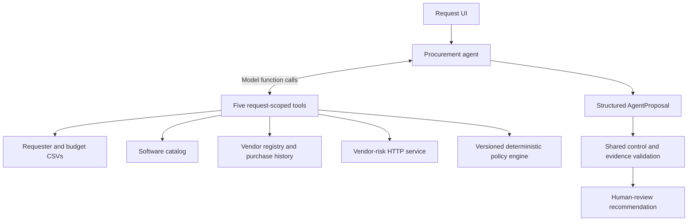
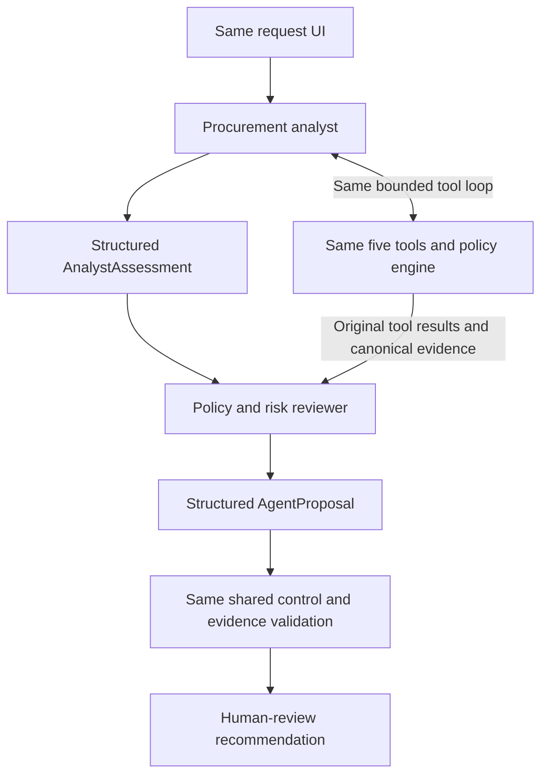

# Workflow, architecture, and assumptions

## Product workflow

```mermaid
flowchart LR
  R[Employee request] --> V[Validate input]
  V --> E[Read-only evidence tools]
  E --> P[Deterministic policy checks]
  P --> AI[Context interpretation and recommendation]
  AI --> G[Validate citations and preserve required controls]
  G --> UI[Evidence, missing information, risks, next step]
  UI --> H[Download human review handoff]
  H --> M[Humans verify evidence and approve or reject]
```

The final approval step is outside this local application. A downloaded handoff is a prepared package, not a submitted approval or completed purchase. Every reviewer remains pending. The app has no procurement, payment, budget mutation, or approval tools.

## Architecture A: single procurement agent

In live mode, the same agent calls tools and returns a structured proposal. Retrieval is limited to two model rounds, followed by one structured-output call. If the agent omits tools, code completes mandatory retrieval coverage. `policy_check` also collects its four prerequisites. Tool results are cached only within that request; five executed tools are counted separately from model requests. Repeated invocations return the same result without claiming new retrieval.

## Architecture B: analyst and policy/risk reviewer

The reviewer uses a fresh context with the original evidence ledger, original tool results, and the analyst's structured assessment. The analyst output remains untrusted. It is not the only source available to the reviewer. Both stages use the same configured model to isolate the architecture difference. B adds exactly one structured model request after the analyst, provided retrieval is otherwise the same. There is no recursive delegation or third agent.

## Offline simulation

Offline mode calls all five real tools, including the mock HTTP service. It substitutes deterministic context heuristics for model reasoning. A produces a simulated proposal; B builds a simulated analyst assessment and feeds it into the reviewer simulation. Both report **zero LLM calls and zero tokens**. This tests product behavior, evidence provenance, and coded policy controls; it does not measure live model quality.

## Tools and trust boundary

| Tool | Inputs | Output and authority |
| --- | --- | --- |
| `requester_budget` | Bound request's requester and cost | Employee/manager, department budget, canonical budget facts |
| `software_catalog` | Bound product/vendor/category/use case | Approved options with scope and licensed seats; no claim about unused capacity |
| `vendor_registry` | Bound vendor | Internal onboarding/security/legal status and purchase history |
| `vendor_risk` | Bound vendor, server-configured endpoint | Validated external HTTP status; timeout, malformed/mismatched response, 404 and 503 are failures |
| `policy_check` | Request and original tool results | Deterministic required approvals, missing information, flags, and source policy |

Tools accept empty arguments only. A model cannot select a different employee, modify a budget, redirect an endpoint, or invoke a write operation. The endpoint and model key are server-side configuration, not model-controlled arguments.

Evidence has a run-local ID, source, finding, and record/policy reference. Models select ledger IDs instead of authoring evidence. The final response contains the canonical tool ledger. Unsupported citations cause manual review. Required approvals, material missing information, risk flags, human-review status, and actionable next steps are preserved by code even after a model failure.

Injection detection is diagnostic and intentionally limited. Authority does not depend on detecting every attack: untrusted strings never become executable instructions for the policy engine or tools. Prompts also mark requester/API/registry text and prior agent outputs as business data. Live semantic persuasion can still affect a model's rationale and requires evaluation; the application does not claim universal prompt-injection immunity.

## Policy interpretations and assumptions

- The source policy is version 2026.09 with reference date 2026-09-30. A review aged exactly 365 days is current; 366 days, missing/invalid dates, and future dates are unverified. The date check never uses today's system clock.
- Spend is already annualized in USD. Inputs are finite, nonnegative amounts with at most two decimal places; thresholds compare exact decimal values. Currency conversion and monthly-cost annualization are outside scope.
- Unknown cost cannot determine a spend band; Procurement and Finance must verify the amount before threshold approvals can be computed. The model cannot supply a fabricated cost.
- The internal registry and service must agree on review status/date. `Pending` and `not_completed` are equivalent; discrepancies require Security reconciliation. Neither source silently wins.
- Sensitive data/integrations add Security review regardless of vendor approval or prior purchase. Outside-region sensitive-data storage adds Privacy and Legal; PII always adds Privacy.
- Licensed seats do not reveal spare seats. Catalog matching retrieves likely options; a human verifies feature fit, capacity and scope. The offline gap heuristic recognizes explicit expansion/add-on/training or gap language and is not a general semantic understanding system.
- Extra model uncertainty or review roles may add controls, never remove deterministic controls. A future production version should evaluate whether these additions create unnecessary review burden.
- Policy bytes are checked against the reviewed version's digest to prevent unnoticed policy/engine drift. Updating the source policy requires reviewing the engine, its digest and boundary tests together. Markdown uses LF checkout line endings.
- No login, persistent approval queue, verified human signoff, durable audit store, or production authorization system is supplied. The service binds to loopback and is an assessment prototype.

## Implementation references

`LLM_PROVIDER` selects Gemini or OpenAI for both architectures. Gemini uses the official [generateContent REST API](https://ai.google.dev/api/generate-content), native function calls (preserving thought signatures/call IDs), and JSON-schema output validation. The default [Gemini 3.5 Flash-Lite](https://ai.google.dev/gemini-api/docs/models/gemini-3.5-flash-lite) supports both capabilities and offers a free tier; `GEMINI_MODEL` is configurable. Per-process pacing spaces model calls, including calls across both agent stages; HTTP 429 causes explicit failure without retries. An interrupted evaluation saves incomplete results and stops.

OpenAI remains optional and follows official [Responses function calling](https://developers.openai.com/api/docs/guides/function-calling) and [structured output](https://developers.openai.com/api/docs/guides/structured-outputs) documentation. Its default [GPT-4.1 mini](https://developers.openai.com/api/docs/models/gpt-4.1-mini) is configurable through `OPENAI_MODEL`. Neither provider's account access or actual model quality has been measured in this offline run. The selected provider/model are recorded in telemetry and evaluation summaries.
